# Authentication & Authorization Proposal for Nexus

---

## Glossary

| Term | Full Name | Description |
|------|-----------|-------------|
| **AAP** | Ansible Automation Platform | Red Hat's enterprise automation platform; acts as the OAuth2 provider for Nexus |
| **AAP Gateway** | AAP Gateway API | The API layer of AAP that provides user profile and role information via REST endpoints |
| **API Key** | Application Programming Interface Key | A long-lived secret token for programmatic/automated access without browser-based login |
| **Access Token** | - | Short-lived token (15 min) that authorizes API requests; self-contained JWT |
| **Authorization Code Flow** | - | OAuth2 flow where user authenticates at IdP and receives a code exchanged for tokens |
| **CSRF** | Cross-Site Request Forgery | Attack where malicious site tricks user's browser into making unwanted requests |
| **IdP** | Identity Provider | Service that authenticates users and provides identity information (AAP in this case) |
| **JWT** | JSON Web Token | Compact, URL-safe token format containing claims (user info) signed cryptographically |
| **OAuth 2.0** | Open Authorization 2.0 | Authorization framework for granting limited access to resources; used by AAP Gateway |
| **OIDC** | OpenID Connect | Identity layer on top of OAuth 2.0; provides authentication and user info via ID tokens. Planned for AAP 2.7 |
| **PKCE** | Proof Key for Code Exchange | Security extension for OAuth preventing authorization code interception attacks |
| **RBAC** | Role-Based Access Control | Access control model where permissions are assigned to roles, not individual users |
| **Refresh Token** | - | Long-lived token (24 hours) used to obtain new access tokens without re-authentication |
| **SPA** | Single Page Application | JavaScript frontend (React, Vue, etc.) that runs in the browser and calls APIs |
| **XSS** | Cross-Site Scripting | Attack where malicious scripts are injected into web pages viewed by other users |

> **Note**: AAP Gateway supports OAuth 2.0 but does not provide OIDC userinfo claims. User profile and role data must be fetched via separate Gateway API calls after OAuth2 authentication.

---

## Executive Summary

This proposal defines the authentication and authorization architecture for Nexus, using Ansible Automation Platform (AAP) Gateway as the OAuth 2.0 provider. The system supports two authentication methods: OAuth2-based browser authentication for interactive users (SPA) and API keys for programmatic access (automation/scripts).

**Key Architecture Decision**: Since AAP Gateway supports OAuth 2.0 but does not provide OIDC userinfo claims, the authentication flow is split into two phases:
1. **OAuth2 Authentication** - User authenticates via AAP Gateway's OAuth2 endpoints
2. **User Data Retrieval** - Nexus fetches user profile and roles via AAP Gateway REST API

### AAP Version Compatibility

| AAP Version | Protocol | User Data Source | Status |
|-------------|----------|------------------|--------|
| **2.6** (current) | OAuth 2.0 | Gateway REST API | **This proposal** |
| **2.7** (planned) | OIDC | ID Token claims | Future enhancement |

> **Design Principle**: This implementation uses a **modular authentication provider pattern** to allow seamless migration from OAuth2 to OIDC when AAP 2.7 is released. See [Section 14: Future Improvements](#14-future-improvements---oidc-support-aap-27) for the OIDC migration plan.

---

## 1. Requirements

### Functional Requirements
- **OAuth2 Authentication**: Authenticate users via AAP Gateway's OAuth 2.0 endpoints
- **User Data Retrieval**: Fetch user profile (username, email, full name) from AAP Gateway API after OAuth2 auth
- **Role Synchronization**: Sync user roles (Normal User, Auditor, System Admin) from AAP Gateway API on each login
- **API Key Support**: Allow automation/scripts to authenticate without browser-based OAuth2
- **Session Management**: 24-hour maximum session length with 15-minute access tokens
- **Universal Protection**: All Nexus endpoints require authentication

### Non-Functional Requirements
- **Security**: Follow OWASP and OAuth 2.0 best practices
- **Performance**: Minimize latency by avoiding OAuth2/Gateway calls during normal API requests
- **Stateless**: JWT-based authentication for horizontal scaling
- **Auditability**: Log all authentication events

### UX Goals

#### 1. Performance Independence

JWT tokens enable Nexus to operate independently from AAP during normal use:

| Scenario | AAP Calls | Nexus Calls |
|----------|-----------|-------------|
| Normal API request | 0 | 1 (JWT validated locally) |
| Access token refresh | 0 | 1 (refresh endpoint) |
| Initial login | 2-3 (OAuth2 + Gateway API) | 1 (callback + token issue) |
| Session expired (24h) | 2-3 (OAuth2 + Gateway API) | 1 (new login required) |

**Rationale**: By issuing Nexus-specific JWTs after OAuth2 authentication + Gateway API data fetch, all subsequent API calls are validated locally without contacting AAP. This provides:
- Lower latency (no external calls)
- Higher availability (AAP outage doesn't break active sessions)
- Reduced load on AAP

#### 2. Multi-Tab Graceful Recovery

When multiple browser tabs are open and the refresh token expires, the system must recover gracefully:

**Anti-Pattern (What NOT to do):**
```
Tab 1: Token expired → Auto-redirect to OAuth2 login
Tab 2: Token expired → Auto-redirect to OAuth2 login
Tab 3: Token expired → Auto-redirect to OAuth2 login
...
Tab 1: Completes login → Gets new tokens
Tab 2-10: Stuck at AAP (already logged in, can't redirect back)  ← LIMBO STATE
```

**Required Behavior:**

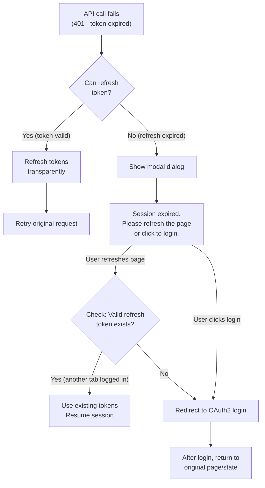

**Implementation Strategy (Initial - Simple):**

1. **On 401 response with expired refresh token:**
   - Do NOT auto-redirect to OAuth2
   - Show modal: "Your session has expired. Please refresh the page to continue."
   - Store current URL/state in sessionStorage

2. **On page refresh:**
   - Check if valid refresh token exists (another tab may have logged in)
   - If yes → use it, resume session
   - If no → redirect to OAuth2 login with return URL

3. **After OAuth2 login:**
   - Redirect back to stored URL/state
   - Clear stored state

**Future Enhancement (BroadcastChannel API):**

For automatic multi-tab sync without page refresh:

```javascript
// When one tab gets new tokens
const channel = new BroadcastChannel('nexus-auth');
channel.postMessage({ type: 'TOKEN_REFRESH', timestamp: Date.now() });

// Other tabs listen
channel.onmessage = (event) => {
  if (event.data.type === 'TOKEN_REFRESH') {
    // Reload tokens from storage/cookie
    refreshAuthState();
  }
};
```

This enhancement is optional for initial implementation but provides better UX for power users with many tabs.

---

## 2. Authentication Architecture

### 2.1 High-Level Flow

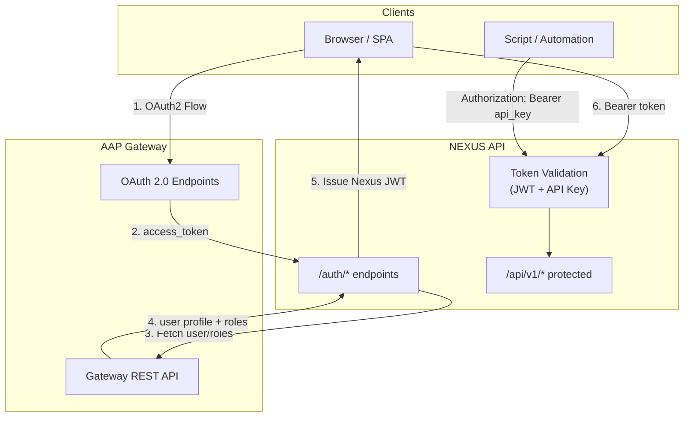

### 2.2 Authentication Methods

| Method | Use Case | Token Type | Lifetime |
|--------|----------|------------|----------|
| OAuth2 + JWT | Interactive users (SPA) | Access Token (JWT) + Refresh Token | 15 min / 24 hours |
| API Key | Automation, scripts, CI/CD | Bearer Token | Configurable (no expiry or set expiry) |

### 2.3 Modular Authentication Provider Design

To support future OIDC migration (AAP 2.7), the authentication layer uses a **provider abstraction pattern**:

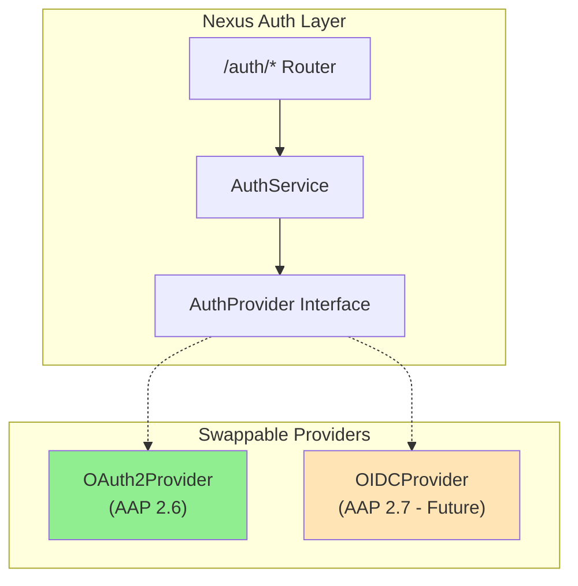

#### Provider Interface

```python
from abc import ABC, abstractmethod
from dataclasses import dataclass

@dataclass
class AuthenticatedUser:
    """Unified user data structure from any auth provider."""
    external_id: str       # AAP user ID
    username: str
    email: str
    full_name: str
    roles: list[str]       # Raw roles from AAP
    raw_token: str         # Original access token (for API calls)

class AuthProvider(ABC):
    """Abstract base for authentication providers."""

    @abstractmethod
    async def get_authorization_url(self, state: str, redirect_uri: str) -> str:
        """Generate the authorization URL for user redirect."""
        pass

    @abstractmethod
    async def exchange_code(self, code: str, redirect_uri: str) -> str:
        """Exchange authorization code for access token."""
        pass

    @abstractmethod
    async def get_user_info(self, access_token: str) -> AuthenticatedUser:
        """Fetch user profile and roles using the access token."""
        pass

    @abstractmethod
    async def revoke_token(self, token: str) -> bool:
        """Revoke a token (if supported by provider)."""
        pass
```

#### Current Implementation (AAP 2.6 - OAuth2)

```python
class OAuth2Provider(AuthProvider):
    """OAuth2 provider for AAP 2.6 - requires separate Gateway API calls."""

    async def get_user_info(self, access_token: str) -> AuthenticatedUser:
        # Two separate API calls required
        profile = await self._fetch_user_profile(access_token)
        roles = await self._fetch_user_roles(access_token)

        return AuthenticatedUser(
            external_id=str(profile["id"]),
            username=profile["username"],
            email=profile["email"],
            full_name=f"{profile['first_name']} {profile['last_name']}",
            roles=roles,
            raw_token=access_token,
        )
```

#### Future Implementation (AAP 2.7 - OIDC)

```python
class OIDCProvider(AuthProvider):
    """OIDC provider for AAP 2.7 - user info in ID token claims."""

    async def get_user_info(self, access_token: str) -> AuthenticatedUser:
        # All user data from ID token - no additional API calls
        id_token = self._decode_id_token(access_token)

        return AuthenticatedUser(
            external_id=id_token["sub"],
            username=id_token["preferred_username"],
            email=id_token["email"],
            full_name=id_token["name"],
            roles=id_token.get("roles", []),
            raw_token=access_token,
        )
```

#### Provider Selection (Configuration-Based)

```python
# src/nexus/core/config.py
class Settings(BaseSettings):
    # Provider selection
    auth_provider: Literal["oauth2", "oidc"] = "oauth2"

# src/nexus/api/auth/factory.py
def get_auth_provider(settings: Settings) -> AuthProvider:
    if settings.auth_provider == "oidc":
        return OIDCProvider(settings)
    return OAuth2Provider(settings)  # Default for AAP 2.6
```

This design ensures:
- **No code changes** to switch providers (configuration only)
- **Consistent interface** for AuthService regardless of provider
- **Easy testing** with mock providers
- **Gradual migration** - can run OAuth2 and OIDC in parallel for testing

---

## 3. Token Strategy

### 3.1 Terminology Clarification

Your original idea uses "short-lived JWT" and "long-lived JWT." To align with industry standards:

| Your Term | Standard Term | Purpose |
|-----------|---------------|---------|
| Short-lived JWT (15 min) | **Access Token** | Authorizes API requests |
| Long-lived JWT (24 hours) | **Refresh Token** | Issues new access tokens without OAuth2 re-auth |

### 3.2 Token Flow (OAuth2 Users)

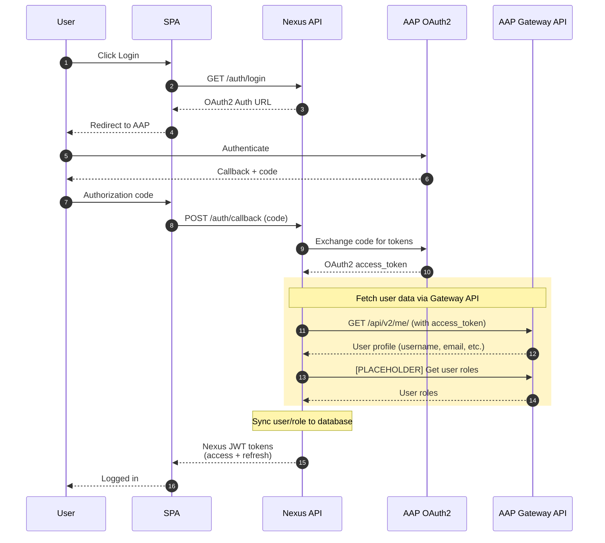

> **TODO**: The Gateway API endpoints for fetching user profile and roles need to be confirmed. See [Section 3.5: AAP Gateway API Integration](#35-aap-gateway-api-integration) for placeholders.

### 3.3 Token Refresh Flow

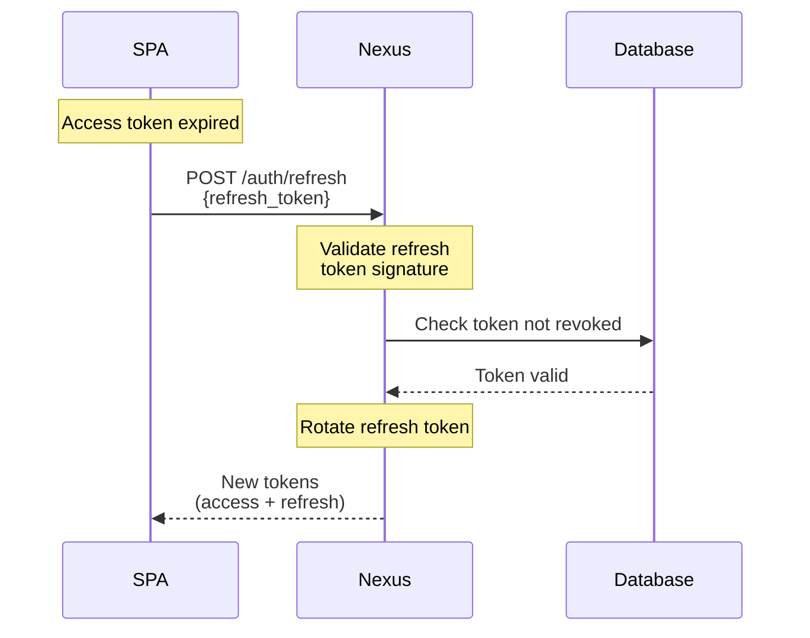

### 3.4 Token Specifications

#### Access Token (JWT)
```json
{
  "sub": "user-uuid",
  "username": "john.doe",
  "email": "john.doe@example.com",
  "role": "ADMINISTRATOR",
  "iat": 1705849200,
  "exp": 1705850100,
  "iss": "nexus",
  "aud": "nexus-api",
  "type": "access"
}
```

| Claim | Description |
|-------|-------------|
| `sub` | User UUID (matches database) |
| `username` | User's username |
| `email` | User's email |
| `role` | User role (VIEWER, CREATOR, APPROVER, ADMINISTRATOR) |
| `exp` | Expiration (15 minutes from issuance) |
| `type` | Token type identifier |

#### Refresh Token (JWT or Opaque)

**Option A: JWT Refresh Token** (stateless but requires rotation)
```json
{
  "sub": "user-uuid",
  "jti": "unique-token-id",
  "iat": 1705849200,
  "exp": 1705935600,
  "type": "refresh"
}
```

**Option B: Opaque Refresh Token** (stored in database, more control)
- Random 256-bit token stored in database
- Easier revocation, rotation detection
- Slightly more database load

**Recommendation**: Use **JWT refresh tokens** with a **revocation list** stored in Valkey (Redis). This balances stateless validation with revocation capability.

### 3.5 AAP Gateway API Integration

> **⚠️ PLACEHOLDER SECTION - REQUIRES REVISION**
>
> This section contains placeholders for AAP Gateway API endpoints. The specific endpoints, request/response formats, and authentication requirements must be confirmed with the AAP Gateway team.

Since AAP Gateway does not provide OIDC userinfo claims, Nexus must fetch user data via direct API calls after OAuth2 authentication.

#### Required Data from Gateway

| Data | Purpose | Placeholder Endpoint |
|------|---------|---------------------|
| User profile | Username, email, full name for Nexus user record | `GET /api/v2/me/` |
| User roles | Determine Nexus role (Viewer, Creator, Approver, Admin) | `[TBD]` |
| Organization/Team | Multi-tenancy support (if applicable) | `[TBD]` |

#### Placeholder: User Profile Endpoint

```http
GET /api/v2/me/
Authorization: Bearer <aap_access_token>

Response (expected):
{
  "id": 123,
  "username": "john.doe",
  "email": "john.doe@example.com",
  "first_name": "John",
  "last_name": "Doe",
  ...
}
```

> **TODO**: Confirm the exact response schema and available fields.

#### Placeholder: User Roles Endpoint

```http
[METHOD] [ENDPOINT TBD]
Authorization: Bearer <aap_access_token>

Response (expected):
{
  "roles": ["normal_user"],  // or "auditor", "system_admin"
  ...
}
```

> **TODO**: Determine how roles are exposed in AAP Gateway:
> - Dedicated roles endpoint?
> - Included in user profile response?
> - Derived from team/organization membership?

#### Placeholder: Role Mapping

```python
# Mapping from AAP Gateway roles to Nexus roles
# TODO: Confirm AAP role names
AAP_TO_NEXUS_ROLE = {
    "system_admin": UserRole.ADMINISTRATOR,  # [TBD] - confirm AAP role name
    "auditor": UserRole.APPROVER,            # [TBD] - confirm AAP role name
    "normal_user": UserRole.CREATOR,         # [TBD] - confirm AAP role name
    # Default fallback
    None: UserRole.VIEWER,
}
```

#### Open Questions for Gateway Integration

| # | Question | Impact |
|---|----------|--------|
| 1 | What is the base URL for AAP Gateway API? | Configuration |
| 2 | Does `/api/v2/me/` include role information? | May reduce API calls |
| 3 | How are system admin vs normal user roles distinguished? | Role mapping logic |
| 4 | Is there rate limiting on Gateway API? | Error handling |
| 5 | What authentication does Gateway API accept? | Must use OAuth2 access token |
| 6 | Are there pagination or caching considerations? | Performance |

---

## 4. Evaluation of Original Idea

### Key Concerns Summary

> **These are the main issues identified with the original proposal that require attention:**

| # | Concern | Risk Level | Recommendation |
|---|---------|------------|----------------|
| 1 | **SPA Token Storage** | High | Store refresh tokens in HTTP-only cookies, not localStorage |
| 2 | **Refresh Token Theft Window** | Medium | Implement token rotation with reuse detection |
| 3 | **Delayed Role Revocation** | Low | Accept 15-min delay; add manual revocation for emergencies |
| 4 | **Session Independence** | Low | Acceptable; Nexus and AAP sessions are intentionally decoupled |

Each concern is detailed in sections 4.1-4.4 below.

---

### What's Correct

| Aspect | Evaluation |
|--------|------------|
| OAuth2 for authentication | Correct - AAP Gateway as IdP is standard |
| Role sync on each login | Correct - ensures role consistency |
| 15-minute access token | Correct - industry standard |
| No OAuth2/Gateway calls during normal ops | Correct - JWTs are self-contained |

### Concerns & Recommendations

#### 4.1 Refresh Token Storage (SPA Security)

**Concern**: SPAs cannot securely store refresh tokens in localStorage or sessionStorage (XSS risk).

**Recommendation**: Use **HTTP-only cookies** for refresh tokens:

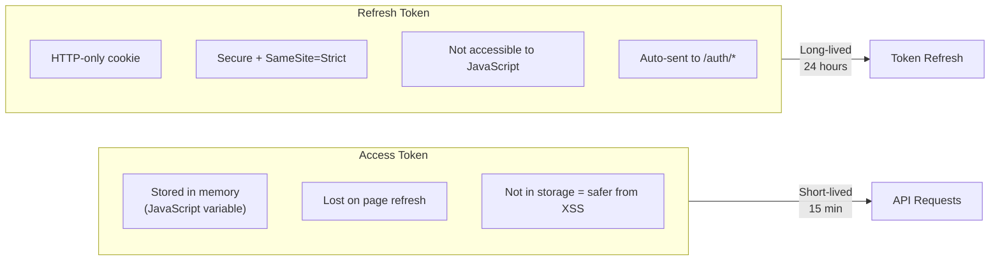

#### 4.2 Refresh Token Rotation

**Concern**: If a refresh token is stolen, attacker has 24-hour access window.

**Recommendation**: Implement **refresh token rotation with reuse detection**:

1. Each refresh issues a new refresh token
2. Old refresh token is invalidated
3. If old token is reused → revoke ALL user tokens (possible theft detected)

```python
# Pseudocode
def refresh_tokens(old_refresh_token):
    token_record = db.get_refresh_token(old_refresh_token)

    if token_record.is_used:
        # Token reuse detected - possible theft!
        revoke_all_user_tokens(token_record.user_id)
        raise SecurityException("Token reuse detected")

    token_record.is_used = True
    db.save(token_record)

    new_access_token = create_access_token(user)
    new_refresh_token = create_refresh_token(user)

    return new_access_token, new_refresh_token
```

#### 4.3 Session Termination on Role Change

**Concern**: If a user's role is revoked in AAP, they retain access until token expiry.

**Options**:
1. **Accept 15-min delay** - Simple, role change takes effect within 15 min
2. **Token revocation** - Admin can manually revoke all user tokens
3. **Role validation on sensitive ops** - Check database role for critical operations

**Recommendation**: Option 1 for general use + Option 2 for emergencies.

#### 4.4 AAP Session vs Nexus Session

**Concern**: Your design has Nexus issue its own JWTs. What happens if the AAP session expires but Nexus refresh token is still valid?

**Scenarios**:
- AAP session: 8 hours
- Nexus refresh: 24 hours
- User logs out of AAP at hour 4

**Recommendation**: This is acceptable. Nexus sessions are independent. For stricter coupling:
- Reduce Nexus refresh token to 8 hours (match AAP)
- Or implement "logout webhook" from AAP (if available)

---

## 5. API Key Authentication

For automation and scripts that cannot use browser-based OAuth2.

### 5.1 API Key Model

```python
class APIKey(BaseResource, table=True):
    """API Key for programmatic access."""

    user_id: uuid.UUID = Field(foreign_key="user.id")
    name: str  # Human-readable name for the key
    key_hash: str  # bcrypt hash of the key
    key_prefix: str  # First 8 chars for identification (e.g., "nex_abc1")
    expires_at: datetime | None  # Optional expiration
    last_used_at: datetime | None
    scopes: list[str]  # Optional: limit what key can do
    is_active: bool = True
```

### 5.2 API Key Generation

```
POST /api/v1/auth/api-keys
Authorization: Bearer <access_token>

{
  "name": "CI/CD Pipeline",
  "expires_at": "2025-12-31T23:59:59Z"  // optional
}

Response:
{
  "id": "uuid",
  "name": "CI/CD Pipeline",
  "key": "nex_abc12345...xyz",  // Only shown once!
  "key_prefix": "nex_abc1",
  "created_at": "...",
  "expires_at": "2025-12-31T23:59:59Z"
}
```

### 5.3 API Key Usage

```bash
# Using API key for authentication
curl -H "Authorization: Bearer nex_abc12345...xyz" \
     https://nexus.example.com/api/v1/workflows
```

### 5.4 API Key vs JWT Detection

The authentication middleware detects token type:

```python
def get_current_user(authorization: str) -> User:
    token = extract_bearer_token(authorization)

    if token.startswith("nex_"):
        # API Key authentication
        return validate_api_key(token)
    else:
        # JWT authentication
        return validate_jwt(token)
```

---

## 6. Role-Based Access Control (RBAC)

### 6.1 Role Hierarchy

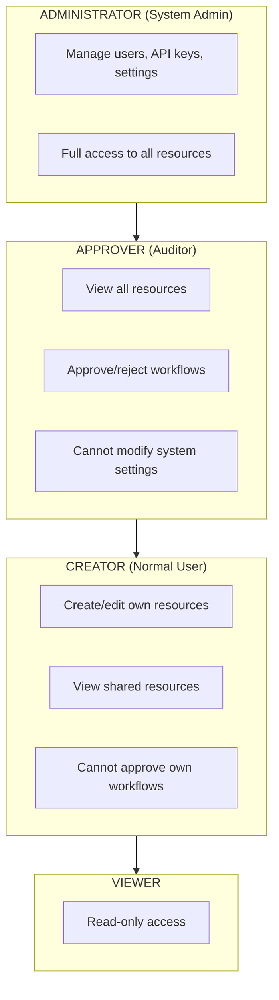

### 6.2 Role Mapping from AAP

Map AAP Gateway roles to Nexus roles:

```python
AAP_TO_NEXUS_ROLE = {
    "system_admin": UserRole.ADMINISTRATOR,
    "auditor": UserRole.APPROVER,
    "normal_user": UserRole.CREATOR,
    # Default fallback
    None: UserRole.VIEWER,
}
```

### 6.3 Permission Enforcement

Use FastAPI dependencies:

```python
def require_role(min_role: UserRole):
    """Dependency that enforces minimum role level."""
    async def checker(current_user: User = Depends(get_current_user)):
        if current_user.role.value < min_role.value:
            raise HTTPException(403, "Insufficient permissions")
        return current_user
    return checker

# Usage
@router.delete("/{id}")
async def delete_workflow(
    id: uuid.UUID,
    user: User = Depends(require_role(UserRole.ADMINISTRATOR))
):
    ...
```

---

## 7. Database Schema Changes

### 7.1 New Tables

```sql
-- Refresh token tracking (for rotation/revocation)
CREATE TABLE refresh_token (
    id UUID PRIMARY KEY,
    user_id UUID REFERENCES "user"(id),
    token_hash VARCHAR(256) NOT NULL,  -- SHA-256 of token
    is_used BOOLEAN DEFAULT FALSE,      -- For rotation detection
    revoked_at TIMESTAMP,
    expires_at TIMESTAMP NOT NULL,
    created_at TIMESTAMP DEFAULT NOW(),

    INDEX idx_refresh_token_hash ON refresh_token(token_hash),
    INDEX idx_refresh_token_user ON refresh_token(user_id)
);

-- API Keys
CREATE TABLE api_key (
    id UUID PRIMARY KEY,
    user_id UUID REFERENCES "user"(id),
    name VARCHAR(255) NOT NULL,
    key_hash VARCHAR(256) NOT NULL,     -- bcrypt hash
    key_prefix VARCHAR(12) NOT NULL,    -- For identification
    expires_at TIMESTAMP,
    last_used_at TIMESTAMP,
    scopes JSONB DEFAULT '[]',
    is_active BOOLEAN DEFAULT TRUE,
    created_at TIMESTAMP DEFAULT NOW(),
    updated_at TIMESTAMP DEFAULT NOW(),

    INDEX idx_api_key_prefix ON api_key(key_prefix)
);

-- Audit log for auth events
CREATE TABLE auth_event (
    id UUID PRIMARY KEY,
    user_id UUID REFERENCES "user"(id),
    event_type VARCHAR(50) NOT NULL,    -- login, logout, token_refresh, etc.
    ip_address VARCHAR(45),
    user_agent TEXT,
    metadata JSONB,
    created_at TIMESTAMP DEFAULT NOW(),

    INDEX idx_auth_event_user ON auth_event(user_id),
    INDEX idx_auth_event_type ON auth_event(event_type)
);
```

### 7.2 User Table Updates

```sql
-- Add AAP user identifier (from Gateway API)
-- TODO: Confirm field name from Gateway API response (e.g., id, username, or external_id)
ALTER TABLE "user" ADD COLUMN aap_user_id VARCHAR(255);
CREATE UNIQUE INDEX idx_user_aap_id ON "user"(aap_user_id) WHERE deleted_at IS NULL;
```

---

## 8. API Endpoints

### 8.1 Authentication Endpoints

| Method | Endpoint | Description |
|--------|----------|-------------|
| GET | `/auth/login` | Initiate OAuth2 login (redirect to AAP) |
| GET | `/auth/callback` | OAuth2 callback (exchange code for tokens + fetch user data) |
| POST | `/auth/refresh` | Refresh access token |
| POST | `/auth/logout` | Revoke tokens and clear session |
| GET | `/auth/me` | Get current user info |

### 8.2 API Key Management

| Method | Endpoint | Description |
|--------|----------|-------------|
| GET | `/api/v1/auth/api-keys` | List user's API keys |
| POST | `/api/v1/auth/api-keys` | Create new API key |
| DELETE | `/api/v1/auth/api-keys/{id}` | Revoke API key |

### 8.3 Admin Endpoints

| Method | Endpoint | Description |
|--------|----------|-------------|
| POST | `/api/v1/admin/users/{id}/revoke-tokens` | Revoke all user tokens |
| GET | `/api/v1/admin/auth-events` | View auth audit log |

---

## 9. Implementation Libraries

| Library | Purpose | Notes |
|---------|---------|-------|
| `authlib` | OAuth2 client | FastAPI/Starlette integration, PKCE support |
| `python-jose[cryptography]` | JWT creation/validation | Recommended for Nexus JWT tokens |
| `httpx` | HTTP client | For Gateway API calls (async support) |
| `passlib[bcrypt]` | API key hashing | Secure password/key hashing |

### 9.1 Configuration

```python
# src/nexus/core/config.py additions
class Settings(BaseSettings):
    # OAuth2 Configuration
    oauth2_authorization_url: str  # e.g., https://aap.example.com/o/authorize/
    oauth2_token_url: str          # e.g., https://aap.example.com/o/token/
    oauth2_client_id: str
    oauth2_client_secret: SecretStr
    oauth2_scopes: str = "read"    # TODO: Confirm required scopes

    # AAP Gateway API Configuration
    aap_gateway_base_url: str      # e.g., https://aap.example.com
    # TODO: Add additional Gateway API config as needed

    # JWT Configuration
    jwt_secret_key: SecretStr
    jwt_algorithm: str = "HS256"  # Or RS256 for asymmetric
    access_token_expire_minutes: int = 15
    refresh_token_expire_hours: int = 24

    # API Key Configuration
    api_key_prefix: str = "nex_"
```

---

## 10. Security Considerations

### 10.1 Token Security

| Measure | Implementation |
|---------|----------------|
| HTTPS only | Enforce TLS for all endpoints |
| Secure cookies | `HttpOnly`, `Secure`, `SameSite=Strict` |
| Token rotation | New refresh token on each refresh |
| Reuse detection | Flag and revoke on token reuse |
| Short access tokens | 15-minute expiry limits exposure |

### 10.2 OAuth2 Security

| Measure | Implementation |
|---------|----------------|
| PKCE | Use code_challenge for CSRF protection |
| State parameter | Verify state matches on callback |
| Nonce | Include in ID token for replay protection |
| Token validation | Validate issuer, audience, signature |

### 10.3 API Key Security

| Measure | Implementation |
|---------|----------------|
| Key hashing | bcrypt with cost factor 12 |
| Prefix identification | Non-secret prefix for logging |
| Rate limiting | Limit failed auth attempts per IP |
| Audit logging | Log all API key usage |

---

## 11. Migration Path

### Phase 1: Core Authentication
1. Add OAuth2 + Gateway API configuration
2. Implement `/auth/*` endpoints
3. Update `get_current_user` dependency
4. Create database migrations

### Phase 2: API Keys
1. Implement API key model and endpoints
2. Add dual authentication (JWT + API key)
3. Add API key management UI

### Phase 3: Hardening
1. Add refresh token rotation
2. Implement audit logging
3. Add rate limiting
4. Security review

---

## 12. Open Questions

The following questions require clarification before or during implementation:

### 12.1 AAP Gateway OAuth2 Configuration

| Question | Context |
|----------|---------|
| What are the OAuth2 authorization and token URLs? | Typically `/o/authorize/` and `/o/token/` |
| What OAuth2 scopes are required? | Need scope for reading user data via Gateway API |
| Does AAP Gateway support PKCE? | Required for SPA security; most modern IdPs support it |
| What is the Gateway API base URL? | For fetching user profile and roles |

**Action Required**: Obtain AAP Gateway OAuth2 documentation and test OAuth2 flow.

> **Note**: See [Section 3.5: AAP Gateway API Integration](#35-aap-gateway-api-integration) for user data retrieval placeholders.

### 12.2 Logout Coordination

| Option | Description | Tradeoff |
|--------|-------------|----------|
| Local logout only | Nexus clears its tokens; AAP session remains | Simple; user stays logged into AAP |
| Front-channel logout | Redirect user to AAP logout endpoint | Full logout; requires AAP support |
| Back-channel logout | AAP notifies Nexus when user logs out | Real-time sync; complex to implement |

**Question**: Should logging out of Nexus also terminate the AAP session?

### 12.3 Multi-Tenancy

| Question | Impact |
|----------|--------|
| Single AAP or multiple? | Affects OAuth2 configuration (static vs dynamic) |
| Organization isolation? | May need org_id in tokens and database |
| Cross-org resource sharing? | Affects authorization model |

**Question**: Will Nexus support multiple organizations with different AAP instances?

### 12.4 Rate Limiting

| Endpoint | Suggested Limit | Rationale |
|----------|-----------------|-----------|
| `/auth/login` | 10/min per IP | Prevent brute force |
| `/auth/refresh` | 30/min per user | Normal usage ~4/hour |
| `/auth/callback` | 5/min per IP | Rare in normal use |
| API Key auth failures | 5/min per key prefix | Detect compromised keys |

**Question**: What rate limits are acceptable for your use case?

### 12.5 API Key Scopes

| Question | Options |
|----------|---------|
| Should API keys have limited permissions? | Full user permissions vs restricted scopes |
| What scopes are needed? | `read`, `write`, `admin`, or endpoint-specific |
| Can API keys be org-scoped? | Relevant if multi-tenant |

**Question**: Should API keys inherit full user permissions or support granular scopes?

### 12.6 Session and Token Edge Cases

| Scenario | Current Behavior | Alternative |
|----------|------------------|-------------|
| User deleted in AAP | Access works until token expires (15 min) | Check user status on each request |
| Role changed in AAP | Takes effect on next login | Force re-login or token revocation |
| Password changed in AAP | Nexus session continues | Revoke all Nexus tokens |

**Question**: How strict should Nexus-AAP session coupling be?

---

## 13. Summary

This proposal extends your original idea with:

1. **Correct terminology** (access token / refresh token)
2. **Secure SPA token storage** (HTTP-only cookies for refresh tokens)
3. **Refresh token rotation** with reuse detection
4. **API key support** for automation
5. **Database schema** for token management
6. **Implementation details** with recommended libraries
7. **Modular provider design** for future OIDC migration (Section 2.3)
8. **AAP Gateway API integration** placeholders (Section 3.5)
9. **OIDC migration path** for AAP 2.7 (Section 14)

The 15-minute / 24-hour token strategy is sound and aligns with security best practices. The main additions are around SPA-specific security concerns, automation support, and future-proofing for OIDC.

### Implementation Priority

| Phase | Focus | AAP Version |
|-------|-------|-------------|
| **Phase 1** | OAuth2 + Gateway API (this proposal) | AAP 2.6 |
| **Phase 2** | API Keys + hardening | AAP 2.6 |
| **Phase 3** | OIDC migration | AAP 2.7 |

---

## Appendix A: Flow Diagrams

### A.1 Complete Authentication Flow

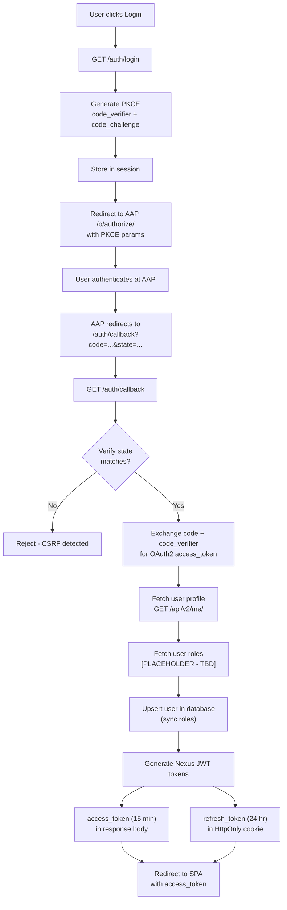

> **Note**: Steps K and L call AAP Gateway API to fetch user data. See [Section 3.5](#35-aap-gateway-api-integration) for endpoint placeholders.

### A.2 Request Authentication Flow

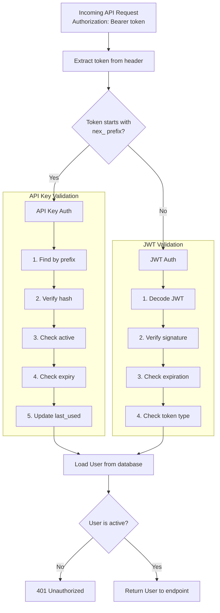

---

## 14. Future Improvements - OIDC Support (AAP 2.7)

> **Timeline**: AAP 2.7 release (planned)
>
> This section documents the migration path from OAuth2 to OIDC when AAP 2.7 adds full OIDC protocol support.

### 14.1 Overview

AAP 2.7 will provide full OIDC support, eliminating the need for separate Gateway API calls to fetch user data. All user information will be available in the ID token claims.

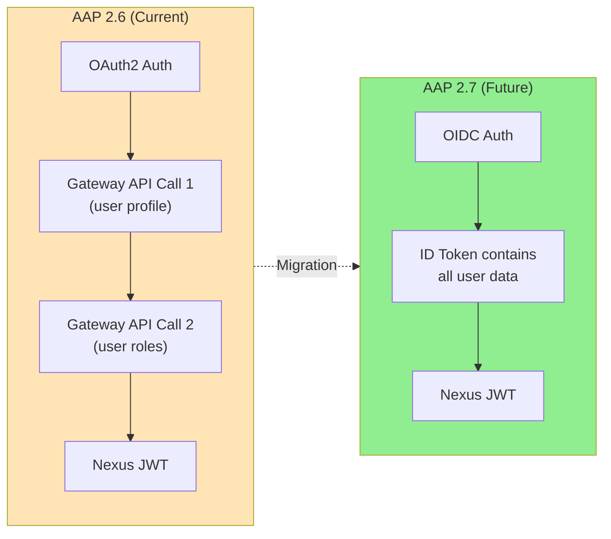

### 14.2 Benefits of OIDC Migration

| Aspect | OAuth2 (AAP 2.6) | OIDC (AAP 2.7) |
|--------|------------------|----------------|
| API calls per login | 3+ (OAuth2 + Gateway API) | 1 (OIDC flow only) |
| User data source | Gateway REST API | ID Token claims |
| Login latency | Higher (multiple round trips) | Lower (single flow) |
| Standardization | Custom integration | Industry standard |
| Token validation | Custom logic | Standard OIDC validation |
| Discovery | Manual configuration | `.well-known/openid-configuration` |

### 14.3 OIDC Implementation Details

#### Expected OIDC Endpoints (AAP 2.7)

| Endpoint | URL Pattern | Purpose |
|----------|-------------|---------|
| Discovery | `/.well-known/openid-configuration` | Auto-discovery of all endpoints |
| Authorization | `/o/authorize/` | User authentication |
| Token | `/o/token/` | Code exchange |
| UserInfo | `/o/userinfo/` | Additional user claims (optional) |
| JWKS | `/o/jwks/` | Public keys for token validation |

#### Expected ID Token Claims

```json
{
  "iss": "https://aap.example.com",
  "sub": "user-uuid-from-aap",
  "aud": "nexus-client-id",
  "exp": 1705850100,
  "iat": 1705849200,
  "auth_time": 1705849200,
  "nonce": "random-nonce",

  "preferred_username": "john.doe",
  "email": "john.doe@example.com",
  "email_verified": true,
  "name": "John Doe",
  "given_name": "John",
  "family_name": "Doe",

  "roles": ["normal_user"],
  "groups": ["team-platform"],
  "organization": "acme-corp"
}
```

> **TODO**: Confirm actual claim names with AAP 2.7 documentation when available.

#### OIDCProvider Implementation

```python
from authlib.integrations.starlette_client import OAuth
from authlib.jose import jwt

class OIDCProvider(AuthProvider):
    """OIDC provider for AAP 2.7+"""

    def __init__(self, settings: Settings):
        self.oauth = OAuth()
        self.oauth.register(
            name="aap",
            client_id=settings.oidc_client_id,
            client_secret=settings.oidc_client_secret,
            server_metadata_url=f"{settings.aap_base_url}/.well-known/openid-configuration",
            client_kwargs={"scope": "openid profile email roles"},
        )

    async def get_authorization_url(self, state: str, redirect_uri: str) -> str:
        # OIDC discovery provides the authorization endpoint
        return await self.oauth.aap.create_authorization_url(
            redirect_uri=redirect_uri,
            state=state,
            nonce=self._generate_nonce(),
        )

    async def exchange_code(self, code: str, redirect_uri: str) -> dict:
        # Returns both access_token and id_token
        token = await self.oauth.aap.fetch_access_token(
            code=code,
            redirect_uri=redirect_uri,
        )
        return token

    async def get_user_info(self, token: dict) -> AuthenticatedUser:
        # Decode and validate ID token
        id_token = token.get("id_token")
        claims = jwt.decode(
            id_token,
            self._get_jwks(),  # Fetch from JWKS endpoint
        )

        # Validate claims
        self._validate_claims(claims)

        # All user data from ID token - no additional API calls!
        return AuthenticatedUser(
            external_id=claims["sub"],
            username=claims["preferred_username"],
            email=claims["email"],
            full_name=claims.get("name", ""),
            roles=claims.get("roles", []),
            raw_token=token["access_token"],
        )

    def _validate_claims(self, claims: dict) -> None:
        """Validate OIDC ID token claims."""
        # Verify issuer
        if claims["iss"] != self.settings.aap_base_url:
            raise AuthError("Invalid issuer")

        # Verify audience
        if claims["aud"] != self.settings.oidc_client_id:
            raise AuthError("Invalid audience")

        # Verify expiration
        if claims["exp"] < time.time():
            raise AuthError("Token expired")

        # Verify nonce (replay protection)
        if not self._verify_nonce(claims.get("nonce")):
            raise AuthError("Invalid nonce")
```

### 14.4 Configuration Changes for OIDC

```python
# src/nexus/core/config.py - AAP 2.7 additions
class Settings(BaseSettings):
    # Provider selection
    auth_provider: Literal["oauth2", "oidc"] = "oauth2"

    # OIDC Configuration (AAP 2.7+)
    oidc_discovery_url: str | None = None  # Auto-discovery URL
    oidc_client_id: str | None = None
    oidc_client_secret: SecretStr | None = None
    oidc_scopes: str = "openid profile email roles"

    # Optional: custom claim mappings
    oidc_username_claim: str = "preferred_username"
    oidc_email_claim: str = "email"
    oidc_roles_claim: str = "roles"
```

### 14.5 Migration Checklist

When AAP 2.7 is released, follow this checklist to migrate:

**Prerequisites (Required before migration):**
- [ ] **PKCE implementation**: Implement PKCE flow (see Section 14.9) - **Required for OIDC**
- [ ] **Verify OIDC support**: Confirm AAP 2.7 OIDC endpoints are available
- [ ] **Test discovery**: Fetch `/.well-known/openid-configuration`
- [ ] **Confirm claims**: Verify ID token contains required claims (username, email, roles)

**Implementation:**
- [ ] **Create OIDC client**: Register Nexus as OIDC client in AAP
- [ ] **Implement OIDCProvider**: Based on template in section 14.3
- [ ] **Integrate PKCE with OIDC**: Ensure `code_challenge` is sent with all authorization requests
- [ ] **Update configuration**: Add OIDC settings, set `auth_provider=oidc`
- [ ] **Test in staging**: Run parallel OAuth2/OIDC to validate

**Deployment:**
- [ ] **Update documentation**: Reflect new configuration options
- [ ] **Deploy**: Switch production to OIDC
- [ ] **Deprecate OAuth2Provider**: After successful migration

### 14.6 Parallel Running Strategy

During migration, support both providers simultaneously:

```python
# Environment-based provider selection
AUTH_PROVIDER=oauth2  # Production (AAP 2.6)
AUTH_PROVIDER=oidc    # Staging (AAP 2.7 testing)
```

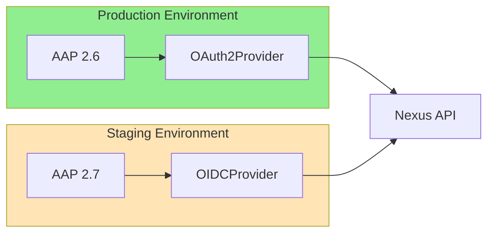

### 14.7 Rollback Plan

If issues arise with OIDC:

1. Set `AUTH_PROVIDER=oauth2` in configuration
2. Restart Nexus services
3. OAuth2Provider will handle authentication
4. Existing Nexus JWTs remain valid (no user disruption)
5. Investigate OIDC issues in staging

> **Note**: The modular provider design (Section 2.3) ensures zero-downtime rollback.

### 14.8 Cross-Tab Token Synchronization (BroadcastChannel API)

To improve the multi-tab experience described in Section 1 (UX Goals), implement automatic token synchronization using the **BroadcastChannel API**.

#### Overview

When one tab successfully re-authenticates after session expiry, it broadcasts a message to all other tabs, allowing them to automatically refresh without requiring manual page reload.

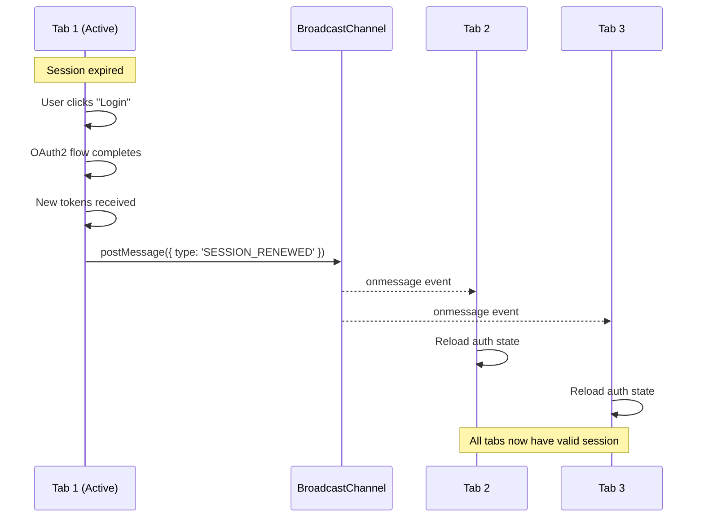

#### Implementation

**1. Auth Channel Service (SPA)**

```typescript
// src/services/authChannel.ts

type AuthEventType = 'SESSION_RENEWED' | 'LOGOUT' | 'TOKEN_REFRESHED';

interface AuthEvent {
  type: AuthEventType;
  timestamp: number;
}

class AuthChannelService {
  private channel: BroadcastChannel;

  constructor() {
    this.channel = new BroadcastChannel('nexus-auth');
    this.setupListener();
  }

  private setupListener(): void {
    this.channel.onmessage = (event: MessageEvent<AuthEvent>) => {
      this.handleMessage(event.data);
    };
  }

  private handleMessage(data: AuthEvent): void {
    switch (data.type) {
      case 'SESSION_RENEWED':
        // Another tab completed login - refresh our auth state
        this.onSessionRenewed();
        break;

      case 'LOGOUT':
        // Another tab logged out - redirect to login
        this.onLogout();
        break;

      case 'TOKEN_REFRESHED':
        // Another tab refreshed tokens - update our state
        this.onTokenRefreshed();
        break;
    }
  }

  // Broadcast events to other tabs
  broadcast(type: AuthEventType): void {
    this.channel.postMessage({
      type,
      timestamp: Date.now(),
    });
  }

  // Called when another tab renews session
  private onSessionRenewed(): void {
    // Option 1: Soft refresh - reload auth state from cookies
    window.location.reload();

    // Option 2: Silent refresh (better UX, more complex)
    // authStore.refreshFromCookies();
  }

  private onLogout(): void {
    // Clear local state and redirect
    authStore.clear();
    window.location.href = '/auth/login';
  }

  private onTokenRefreshed(): void {
    // Update local token state without full reload
    authStore.refreshFromCookies();
  }

  // Cleanup
  close(): void {
    this.channel.close();
  }
}

export const authChannel = new AuthChannelService();
```

**2. Integration with Auth Flow**

```typescript
// After successful OAuth2 callback
async function handleAuthCallback(code: string): Promise<void> {
  const tokens = await authApi.exchangeCode(code);
  authStore.setTokens(tokens);

  // Notify other tabs
  authChannel.broadcast('SESSION_RENEWED');
}

// After token refresh
async function refreshTokens(): Promise<void> {
  const tokens = await authApi.refresh();
  authStore.setTokens(tokens);

  // Notify other tabs
  authChannel.broadcast('TOKEN_REFRESHED');
}

// On logout
async function logout(): Promise<void> {
  await authApi.logout();
  authStore.clear();

  // Notify other tabs
  authChannel.broadcast('LOGOUT');
}
```

**3. Session Expiry Modal with Auto-Recovery**

```typescript
// Enhanced session expiry handling
function handleSessionExpiry(): void {
  // Check if another tab already renewed
  const hasValidSession = checkCookiesForValidSession();

  if (hasValidSession) {
    // Another tab already logged in - just refresh
    authStore.refreshFromCookies();
    return;
  }

  // Show modal with options
  showModal({
    title: 'Session Expired',
    message: 'Your session has expired.',
    actions: [
      {
        label: 'Refresh Page',
        onClick: () => window.location.reload(),
      },
      {
        label: 'Login',
        onClick: () => redirectToLogin(),
      },
    ],
  });

  // Listen for another tab to renew (auto-dismiss modal)
  const channel = new BroadcastChannel('nexus-auth');
  channel.onmessage = (event) => {
    if (event.data.type === 'SESSION_RENEWED') {
      hideModal();
      window.location.reload();
    }
  };
}
```

#### Browser Support

| Browser | Support | Version |
|---------|---------|---------|
| Chrome | ✅ | 54+ |
| Firefox | ✅ | 38+ |
| Safari | ✅ | 15.4+ (March 2022) |
| Edge | ✅ | 79+ |

> **Note**: BroadcastChannel is now supported in all modern browsers. No fallback is required for current browser versions.

#### Benefits

| Aspect | Before (Manual Refresh) | After (BroadcastChannel) |
|--------|-------------------------|--------------------------|
| User action required | Yes (refresh each tab) | No (automatic) |
| Risk of limbo state | High | None |
| Login flow duplication | Multiple tabs may try | Only one tab handles |
| UX consistency | Poor | Excellent |

#### Implementation Priority

This enhancement should be implemented **after** the core OAuth2 authentication is complete:

| Phase | Feature | Priority |
|-------|---------|----------|
| 1 | Core OAuth2 + Gateway API | High |
| 2 | Manual refresh recovery (modal) | High |
| 3 | BroadcastChannel auto-sync | Medium |
| 4 | Silent token refresh (no reload) | Low |

### 14.9 PKCE (Proof Key for Code Exchange)

> **Status**: Recommended for OAuth2 (AAP 2.6), **Required** for OIDC (AAP 2.7)

PKCE is a security extension to the OAuth2 Authorization Code Flow that protects public clients (SPAs, mobile apps) from authorization code interception attacks.

#### Why PKCE Matters

| Attack Vector | Without PKCE | With PKCE |
|---------------|--------------|-----------|
| **Authorization code interception** | Attacker can exchange stolen code for tokens | Code is useless without `code_verifier` |
| **CSRF attacks** | State parameter alone may be insufficient | Dynamic challenge proves request origin |
| **Man-in-the-middle** | Intercepted code can be replayed | Each flow has unique cryptographic proof |
| **Malicious browser extensions** | Can steal codes from URL | Cannot generate valid `code_verifier` |

#### How PKCE Works

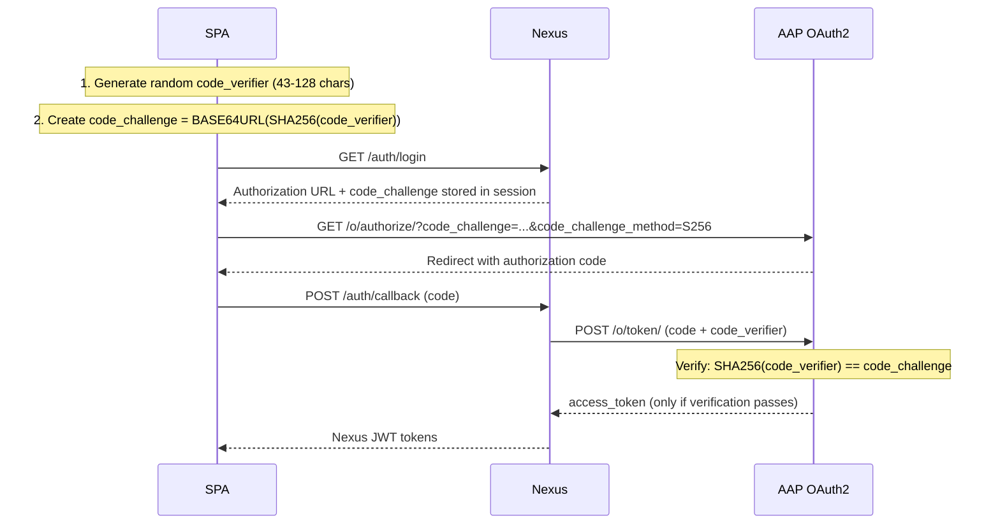

#### Implementation

```python
import secrets
import hashlib
import base64

def generate_pkce_pair() -> tuple[str, str]:
    """Generate PKCE code_verifier and code_challenge."""
    # Generate random 43-128 character verifier
    code_verifier = secrets.token_urlsafe(32)  # 43 chars

    # Create SHA256 hash, then base64url encode (no padding)
    digest = hashlib.sha256(code_verifier.encode()).digest()
    code_challenge = base64.urlsafe_b64encode(digest).rstrip(b'=').decode()

    return code_verifier, code_challenge


# Usage in OAuth2 flow
code_verifier, code_challenge = generate_pkce_pair()

# Store code_verifier in session (server-side)
session["pkce_code_verifier"] = code_verifier

# Include code_challenge in authorization URL
auth_url = (
    f"{settings.oauth2_authorization_url}"
    f"?client_id={settings.oauth2_client_id}"
    f"&response_type=code"
    f"&redirect_uri={redirect_uri}"
    f"&state={state}"
    f"&code_challenge={code_challenge}"
    f"&code_challenge_method=S256"
)

# When exchanging code for tokens
token_response = httpx.post(
    settings.oauth2_token_url,
    data={
        "grant_type": "authorization_code",
        "code": authorization_code,
        "redirect_uri": redirect_uri,
        "client_id": settings.oauth2_client_id,
        "code_verifier": session["pkce_code_verifier"],  # Proves we started the flow
    },
)
```

#### PKCE vs Client Secret

| Aspect | Client Secret | PKCE |
|--------|---------------|------|
| **Security model** | Static shared secret | Dynamic per-request proof |
| **Storage** | Must be kept confidential | `code_verifier` only needs to last one flow |
| **SPA compatibility** | ❌ Cannot be stored securely | ✅ Designed for public clients |
| **Interception protection** | None (secret known to client) | High (cryptographic proof) |
| **OAuth 2.1 compliance** | Optional | **Required for all clients** |

#### When to Implement PKCE

| Phase | AAP Version | Requirement |
|-------|-------------|-------------|
| OAuth2 (current) | AAP 2.6 | **Recommended** - Verify AAP Gateway supports PKCE first |
| OIDC (future) | AAP 2.7 | **Required** - OIDC best practices mandate PKCE |

#### Prerequisites Before Enabling PKCE

- [ ] Confirm AAP Gateway OAuth2 supports PKCE (`code_challenge` parameter)
- [ ] Test PKCE flow in development environment
- [ ] Update OAuth2Provider to generate and verify PKCE pairs
- [ ] Store `code_verifier` in server-side session (not cookies/localStorage)

> **Note**: If AAP Gateway does not currently support PKCE, this should be raised as a requirement for AAP 2.7 OIDC support.
